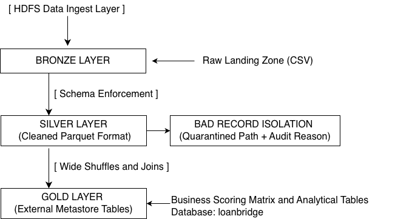

LoanBridge Pipeline: Credit Portfolio Risk & Analytics Engine

Project Overview:

LoanBridge is an enterprise-grade, event-scheduled big data pipeline built on Apache Spark 3.x and Python. The platform ingests large-scale, raw decentralised transactional credit data from HDFS, structures it through a decoupled Multi-Layer Medallion Architecture, and exposes highly optimised analytical schemas in a secure Hive Metastore database instance.

The pipeline features dynamic deployment configurations (LOCAL, DEV), dynamic file-compaction, Adaptive Query Execution (AQE), and comprehensive error-isolation for bad or corrupted source data records

Core Architecture & Medallion Data Lineage:

The engine isolates data state mutation across three distinct relational stages, shifting from untrusted file layers to structured analytical tables.

1. Bronze Layer (Ingestion)

    Raw data in CSV files.

2. Silver Layer (Cleansing and Quarantining)

    Characteristics: Schema enforcement, null-value reconciliation, and string standardization.

    Split-Flow Isolation Pattern: Validated records are written directly to your personal home HDFS directory as high-performance Parquet. Corrupted, malformed, or unverified records are automatically enriched with a reject_reason column and isolated in a quarantined directory path to protect downstream runtime operations from schema corruption.

3. Gold Layer (Business Intelligence and Scoring)

    Characteristics: Wide relational dependency joins, risk calculations, and aggregations.
    
    Metastore Schema Integration: Data assets are registered inside the Hive Metastore database catalog under the isolated namespace: loanbridge. All tables are defined as External Tables mapped directly to explicit, user-owned HDFS blocks. This pattern isolates data definitions from metadata state drifts and protects cold storage parquet assets from catastrophic drop cascades.

TechStack

Engine: PySpark (Spark 3.x) on YARN
Language: Python 3.11
Env Management: Pipenv (Virtual Environments)
Testing: Pytest (Automated Unit Testing)
Storage: HDFS & Apache Parquet

Environment Configuration Matrix

The application leverages a dual-configuration management design (application.conf for data flow boundaries and pyspark.conf for runtime JVM container definitions). System resources scale fluidly depending on the chosen execution profile parameter passed at submission.

Cluster Properties (pyspark.conf)

    LOCAL Profile: Tailored for localized boundary development. Runs entirely inside a single isolated container instance utilizing a 2G JVM driver heap allocation limit.

    DEV Profile: Runs against a managed YARN cluster layer. Deploys 2 distinct executor containers, utilizing 2 processing cores per instance with a strict 5-partition shuffle layout boundary limit tailored to low-volume engineering test cycles. 

Execution Guide

Follow these exact steps to compile dependencies, synchronize edge configurations, provision the catalog, and execute the Spark runtime engine.

1. Local Testing    
    pipenv install
    pipenv run pytest -v
2. Bundle External Source Library Dependencies
    From your local workspace, package all internal functional libraries, custom modules, and log targets into an external zip archive to be distributed across the YARN container environment:

    zip -r dependencies.zip lib/ logger.py

3. Synchronise Artifacts to the Edge Node Gateway
    Securely transfer deployment bundles, application modules, and production configuration layouts to your authenticated cluster workspace:

    # Upload application dependencies and main file
    scp dependencies.zip application_main.py itv025566@g01.itversity.com:/home/itv025566/ 

    # Upload configuration profiles
    scp configs/*.conf itv025566@g01.itversity.com:/home/itv025566/

4. Provision the Hive Metastore Database
    Establish a secure SSH handshake to the cluster node edge terminal:
    
    ssh itv025566@g01.itversity.com

    Initialise your database namespace instance inside the central catalog, routing the physical storage metadata path explicitly into your authorized storage block:

    spark-sql -e "CREATE DATABASE IF NOT EXISTS loanbridge LOCATION 'loanbridge/dev/hive_warehouse/';"

4. Execute the Spark Pipeline
    Trigger the application engine on YARN via spark-submit. Pass the target deployment phase environment token (DEV/PROD) and execution cycle frequency (DAILY/WEEKLY) variables sequentially:

    spark-submit \
    --master yarn \
    --deploy-mode client \
    --py-files dependencies.zip \
    --files application.conf,pyspark.conf \
    application_main.py DEV WEEKLY

Cluster Optimization & Performance Engineering

This project implements an elite data engineering tuning standard, directly verified via production metrics recorded within the live Spark Web UI.

1. Mitigation of the Small-File Problem (Dynamic AQE Coalescing)
    The Issue: Initial data layouts generated fragmented, un-optimised small files on HDFS (e.g., ~7.6 MB partitions). This introduces massive metadata pressures onto the HDFS NameNode and causes execution delays due to network file-seek constraints.

    The Industrial Solution: Hardcoded .coalesce(1) steps were entirely removed from code blocks to avoid bottlenecks that force parallel tasks down to a single executor thread. Instead, Adaptive Query Execution (AQE) is natively forced in the configuration layers:

    spark.sql.adaptive.enabled = true
    spark.sql.adaptive.coalescePartitions.enabled = true
    spark.sql.adaptive.advisoryPartitionSizeInBytes = 134217728

    The Result: Spark processes calculations with max parallel throughput, and dynamically compacts small tasks down to an advisory target size of 128 MB (matching the native HDFS infrastructure block sizing matrix) precisely at write time.

2. Live Cluster Run Diagnostics (Stage 24 Breakdown)
Our optimisation strategies have been proven effective by the following verified stage metrics extracted from the cluster's live Spark UI tracking log:

Elimination of Processing Skew: 2.26 Million credit tracking records (334 MB in-memory shuffle space) are split perfectly into 5 parallel tasks.

Perfect Task Balance Profile: The task execution timeline confirms completely uniform data distribution. The Minimum task execution duration clocked in at 18 seconds, while the Maximum task duration peaked closely at 23 seconds. This proves that no individual executor is drowning in skewed keys while other cluster nodes sit idle.

Efficient JVM Memory Profiles: Total collective garbage collection overhead tracked at a minimal 0.2 seconds out of the entire 1.8 minute cumulative compute task block duration. This confirms that container executors are executing with highly relaxed heap constraints, completely mitigating the risk of Out Of Memory (OOM) faults.

Data Locality Optimisation: The cluster achieved a NODE_LOCAL: 5 status flag designation across all running compute execution threads. Spark was able to schedule computations directly on the physical storage data nodes housing the targeted HDFS storage block nodes (w01.itversity.com and w02.itversity.com). This entirely eliminated cluster-wide network interconnect traffic bottlenecks during initial read pipelines.